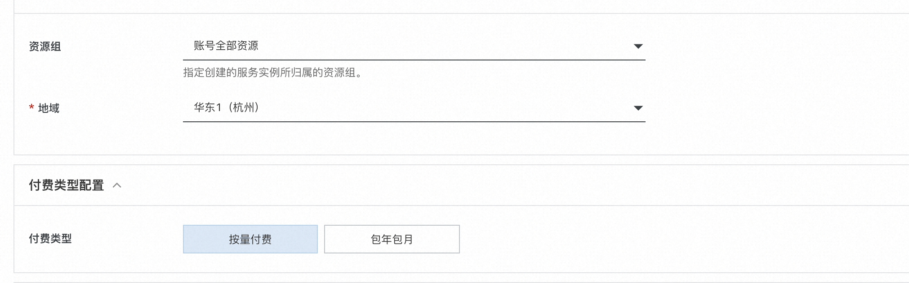

# 快速构建中英文AI对话机器人

>**免责声明：**本服务由第三方提供，我们尽力确保其安全性、准确性和可靠性，但无法保证其完全免于故障、中断、错误或攻击。因此，本公司在此声明：对于本服务的内容、准确性、完整性、可靠性、适用性以及及时性不作任何陈述、保证或承诺，不对您使用本服务所产生的任何直接或间接的损失或损害承担任何责任；对于您通过本服务访问的第三方网站、应用程序、产品和服务，不对其内容、准确性、完整性、可靠性、适用性以及及时性承担任何责任，您应自行承担使用后果产生的风险和责任；对于因您使用本服务而产生的任何损失、损害，包括但不限于直接损失、间接损失、利润损失、商誉损失、数据损失或其他经济损失，不承担任何责任，即使本公司事先已被告知可能存在此类损失或损害的可能性；我们保留不时修改本声明的权利，因此请您在使用本服务前定期检查本声明。如果您对本声明或本服务存在任何问题或疑问，请联系我们。


## 概述

**ChatGLM-6B** 由清华大学团队开发的是一个开源的、支持中英双语的对话语言模型，基于 **General** **Language** **Model** **(GLM)** 架构，具有 62 亿参数。结合模型量化技术，用户可以在**单GPU卡(A10或者V100)上进行部署**。ChatGLM-6B 使用了和 ChatGPT 相似的技术，针对中文问答和对话进行了优化。经过约 1T 标识符的中英双语训练，辅以监督微调、反馈自助、人类反馈强化学习等技术的加持，62 亿参数的 ChatGLM-6B 已经能生成相当符合人类偏好的回答。
# 计算巢实例创建
## 创建实例
访问[计算巢实例](https://computenest.console.aliyun.com/user/cn-hangzhou/recommendService)，点击创建**ChatGLM 中英文对话机器人社区版。**


## 选择所需地域:


勾选实例类型，并填写实例密码：


填写登录用户名和密码，用户名和密码在后续登录webui时使用:


选择网络配置，如果希望在已有vpc中使用，则选择不新建VPC，同时选择VPC的实例ID和交换机ID。否则，可以选择新建VPC如下图所示:


设置模型配置，请将ChatGLM-6B模型权重地址填入PluginGitUrl字段中，如下图所示：


点击下一步:确认订单，并勾选服务条款，点击创建：


由于我们需要下载模型，因此需等待20分钟左右，等待部署完成。
# 执行测试
## 登录页面
点击计算巢控制台中的实例:


点击其中的endpoint网址：


## 测试
输入登录信息中的用户名和密码登录:


进入测试页面:


输入中文对话内容，例如:
```bash
中国有多少个少数民族?
```
点击"发送"，即可开始AI对话：


